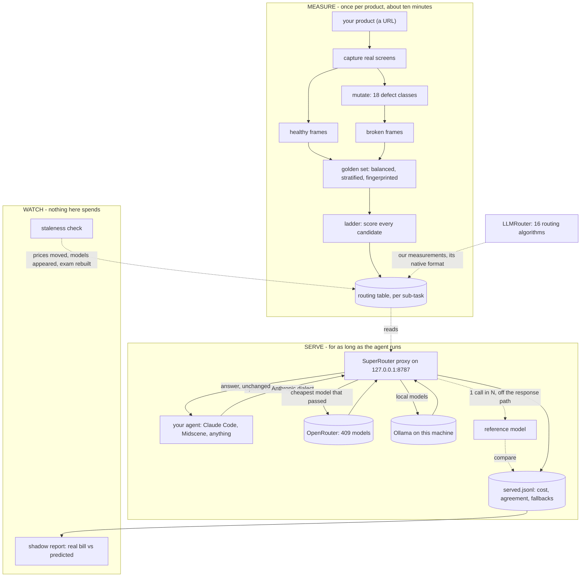
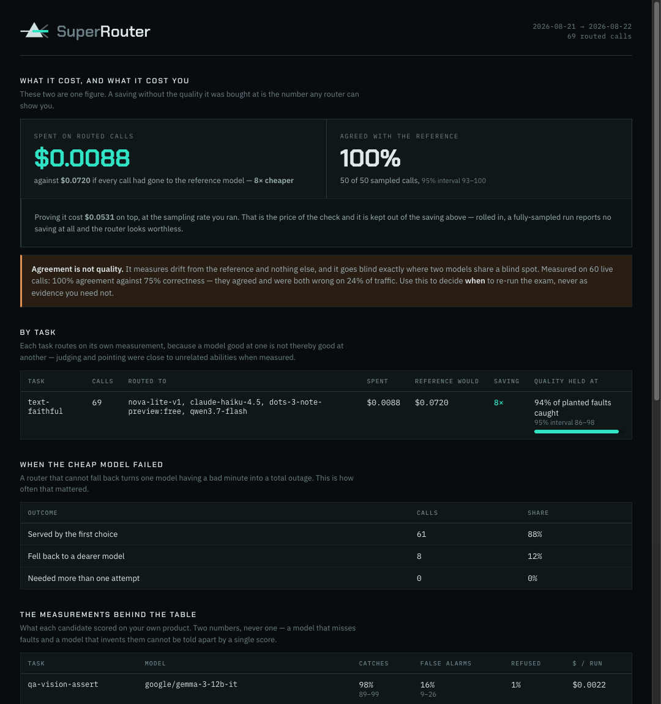
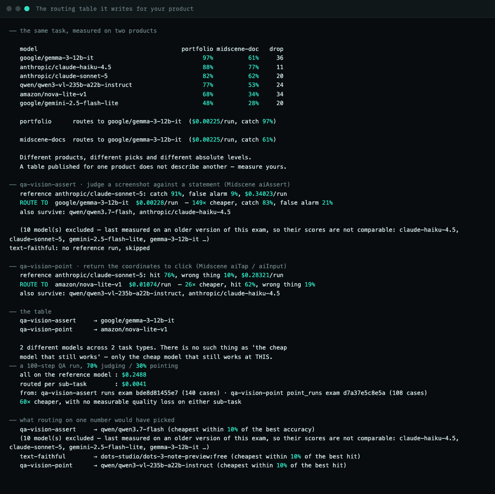
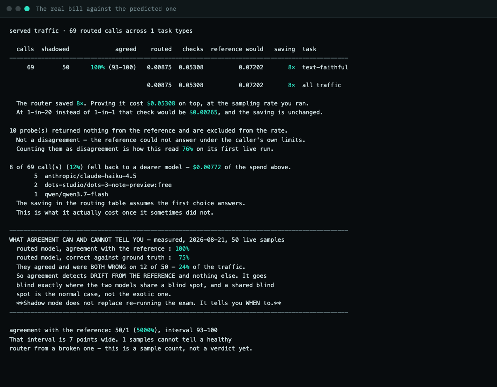

<picture>
  <source media="(prefers-color-scheme: dark)" srcset="assets/logo/mark-dark.svg">
  
</picture>

# SuperRouter

**Integration** — sends each task to the cheapest model that still does it correctly, and proves the "correctly" with a number.

## What it is

Running an agent on a large model is expensive, and most of what an agent does does not need a large model. The obvious fix is to send cheap work to cheap models — but "cheap enough to still be right" is an opinion until somebody measures it, and measuring it needs a marked exam, and marking an exam needs a person. That cost is why every open-source router available today asks you to type a quality score into a config file by hand. They observe speed and price, which a computer can see, and take quality on trust.

SuperRouter measures it instead. You point it at your own product; it takes screenshots, breaks copies of them in ways it chose, and asks every candidate model about both the working and the broken versions. Because it planted the faults, it knows every right answer without anyone labelling anything. Out comes a table of which models are good enough for *your* work and what each one costs, and a proxy that sits between your agent and the model provider and routes on that table.

## How it works

1. **It photographs your product working** — real screens, desktop and mobile, light and dark.
2. **It breaks copies of those screenshots on purpose** — 18 known ways a screen goes wrong: text too faint to read, a control covered up, a section that failed to load, text spilling out of its box.
3. **It writes questions with known answers.** Half the pictures are healthy and half are broken, so a model cannot score well by calling everything broken. Guessing scores 50%, and 50% is printed above every result.
4. **It sits every candidate model down for the same exam** and marks the papers — including asking each one to *point*, not just judge, since the browser already knows where every element really is.
5. **It scores two things separately**: how many planted faults each model caught, and how often it raised a false alarm on a healthy screen. One number cannot separate a model that misses problems from one that invents them.
6. **It decides on the worst plausible case, not the headline.** Every score carries an honest range, and a model qualifies only if the bottom of its range clears your bar. Not yet proven counts as not qualified.
7. **It serves the result as a proxy.** Your agent points at SuperRouter instead of the provider, tags each call with its task, and gets back the cheapest model that passed.
8. **It keeps checking itself.** One call in every N is also sent to the expensive model and the two answers compared, so drift shows up while it is happening.

## Architecture



## Stack

| Layer | What | Why |
|---|---|---|
| Language | Python 3.14, standard library only | no dependency to install before the first run; `urllib` and `http.server` are enough for a proxy |
| Model pool | OpenRouter API, 409 models indexed 2026-08-18 | one key reaches every provider, and it returns the real cost per call rather than an estimate |
| Local models | Ollama, OpenAI-compatible endpoint | the vault's QA lane runs `qwen2.5vl:7b` locally; a model that is not hosted is still a model worth routing to |
| Browser control | `agent-browser` 0.27.0 | drives capture and reads element rectangles out of the live DOM |
| Protocols served | OpenAI `/v1/chat/completions`, Anthropic `/v1/messages` | agents speak one or the other; translation happens at the edge and the router underneath sees neither |
| Routing algorithms | [`ulab-uiuc/LLMRouter`](https://github.com/ulab-uiuc/LLMRouter) 0.4.0 (MIT) | 16 trained algorithms, better than we would write; we supply the labels, not the engine. No code vendored |
| Storage | JSON files under `state/` | every run is a readable record, so results are reproducible from the repo rather than asserted by it |

## The dashboard

`python3 -m superrouter.serve` puts it at `/`; `python3 -m superrouter.report`
writes the same page as a static file you can commit to a pull request. Static
HTML, no dependencies, no telemetry, no network calls when it renders.



**It never shows a saving without the quality it was bought at.** A dashboard
headlining a dollar figure turns this into a cost tool, and anyone can route to
the cheapest model — the argument is that the saving was justified. So every
figure is a pair, every rate carries its denominator and its 95% interval, and
the agreement number carries the caveat that it measures drift rather than
quality.

Thin traffic is called thin in place, rather than rendered as a confident
headline over a handful of requests.

### What it looks like working

| | |
|---|---|
|  |  |
| **The table it writes for your product** — and the same task measured on two products, which is why it ships a method rather than a table | **The real bill against the predicted one** — with the caveat that agreement measures drift, not quality |

Every image in `assets/shots/` is real output from this project's own data, and
regenerates from one command rather than being retouched.

**Deploying this somewhere that is not this machine:** read
[DEPLOYMENT.md](DEPLOYMENT.md). It maps every hidden dependency, names the three
user stories and says which of them actually work today — the largest gap being
that **the project is OpenRouter-only**, so anyone on Azure, Bedrock, Anthropic
direct or a self-hosted vLLM cannot measure anything with it yet.

## Key points

- **The exam builder only knows how to photograph websites today** — a desktop app or an API needs its own capture and its own list of ways it can break; the scoring, statistics and serving are already general.
- **Measuring costs real money** — about $2 for a thorough run across a shortlist; `--dry-run` prices it first, and the tool never spends on its own.
- **It will not tell you what quality bar to set** — it reports what each model catches and what it invents; how many missed faults you can live with is a judgement about your product.
- **A published leaderboard will not substitute for measuring your own product** — across two products, rank order mostly transfers for judging (0.83) but every model dropped a median 22 points, and for pointing the order barely transfers at all (0.49).
- **A high shadow-agreement rate is not evidence of quality** — measured on 60 live calls, the routed model agreed with the reference 100% of the time while being correct 75%.
- **Removing it is safe** — the proxy speaks the provider's own protocol, so taking it out of the path leaves everything working at the old price.

## Getting started

```bash
git clone https://github.com/M19K/superrouter && cd superrouter
export OPENROUTER_API_KEY=sk-or-...
python3 golden/qa-vision/build_generic.py --origin https://your-product.com --name yours
python3 -m superrouter.evals --set yours --dry-run
python3 -m superrouter.evals --set yours --model anthropic/claude-sonnet-5 --model google/gemma-3-12b-it
python3 -m superrouter.route_table
python3 -m superrouter.serve --shadow 20
export ANTHROPIC_BASE_URL=http://127.0.0.1:8787
```

`--set yours` is not optional — it names the exam you just built. Omitting it
was the first thing that broke when this was run from a clean clone with none of
the author's data present, which is the only path a new user takes and the one
that had never been tested.

Building the exam takes about ten minutes and spends nothing. The scored run is
the step that costs money, which is why the dry run sits before it.

**If your product is a simple page, the builder will refuse to write the exam**
rather than emit one whose negative half is a trivial control assertion. Every
model scores near 100% on a set like that and the number means nothing.

## Status and licence

**Working instrument. Not yet proven on live traffic. Audited.**

```bash
python3 -m superrouter.audit --strict
```

Re-derives every number below from the run records and fails if one no longer
matches. It exists because between 2026-08-19 and 2026-08-22 this instrument was
wrong six times, and every time in the same direction — **it scored its own
failure against the model it was measuring**: a timeout read as the model
refusing, an empty answer as a false alarm, an unanswerable reference as the
router disagreeing, two different exams compared as one, the cost of the audit
billed to the saving it audited, and reasoning the harness left switched on
billed to the model as its cost.

None was found by testing with well-behaved models; each surfaced only when
something failed in a way nobody had seen. That is a class, not a run of bad
luck, so it is now asserted structurally against every record on disk rather
than patched one instance at a time. **A seventh instance fails the audit
instead of reaching a reader.**

The first run of it found the README already stale and one directory still
mixing two exams — which is the point.

Measured, with dates:

| | |
|---|---|
| golden sets | 3 task types — 592 text, 462 and 368 judging across two products, 108 pointing |
| models scored | **$4.56 actually spent** across 106 runs; 51 of those are mutually comparable and 55 are quarantined because their exam version cannot be identified |
| best measured saving | **60x on a modelled 100-step QA run** — modelled, see below (70% judging / 30% pointing), no measurable quality loss on either sub-task |
| contribution to LLMRouter | their own trained KNN went from 71% accuracy at $0.031 to **79% at $0.0014** on a held-out split — one field changed, 22x cheaper and 8 points better (2026-08-19) |
| **observed** saving on real traffic | **8x** over 69 routed calls — this is a bill, not a model |
| run-to-run noise | ±2 points; two runs of a 120-case exam agreed 120/120 and 118/120 at temperature 0 (2026-08-22) |

**Not proven, stated plainly:**

- **The 60x is a modelled figure**, computed from measured per-call costs against a realistic task mix. No workload has run through the proxy for a sustained period, so it is a prediction from real measurements rather than an observed bill.
- **There is no automated test suite.** Correctness rests on the integrity rules below, each added after a real failure, and on the run records in `state/`.
- **Prompt caching and extended thinking are accepted and dropped** by the Anthropic translation layer — a caller asking for either gets a correct answer at an uncached price.
- **The pool index is dated.** `python3 -m superrouter.stale` reports what has moved; on 2026-08-21, three days after indexing, 12 models had appeared and 8 already-measured models had changed price, one by 2.4x.

**Licence: Apache-2.0.** [@maaz · 2026-08-23] Chosen over MIT for the same
reason Locus was: an explicit patent grant, which businesses adopting
infrastructure ask for, and room for a paid layer later without relicensing.
LLMRouter is MIT and compatible; none of its code is vendored here in any case.

---

## Integrity rules, each added after a real failure

- **A model that was never asked has not refused.** 41 client timeouts were counted as refusals and read as `refused 27%` — enough to disqualify a model that never saw the request. `errored` and `refused` are now separate columns and only the second counts against the model. This is the fourth instance of one class: *the instrument blaming what it measures for its own failure to get an answer.*
- **Runs from different versions of a golden set are never compared.** Every run fingerprints the exact cases it sat. Without it the table ranked a model measured on 90 easy cases above one measured on 592; one directory held four distinct exams being read as one.
- **Both sides of the exam must be hard.** Faithful cases were verbatim copies of the source, so false-alarm rates sat at 0-3% across seven models and that axis measured nothing.
- **Every failure mode gets an equal share**, and a class that cannot fill its share is named — the classes that separated models were the rarest.
- **A planted defect must move pixels.** One of 18 classes returned success and changed nothing; every fixture is gated against the healthy frame of the same screen.
- **Price is not cost.** One 1280x800 screenshot billed 1,857 input tokens where two documented estimation methods predicted 1,020 and 1,150.
- **Frames are frozen.** The source page renders differently on every load, so scoring live would confuse a worse model with a changed page.

## Credits

`superrouter/stability.py` was written by `@claude-code/product-portfolio` and adopted here rather than rewritten. It compares two runs of one exam case by case, refuses when the fingerprints differ, and excludes cases with no verdict in either run — which is what stops a timeout reading as a model changing its mind.

## Documentation standard

This README follows the Mikoshi Product README Standard (`01-Knowledge Base/Product README Standard.md`), which is the source of truth and is deliberately not copied here.
